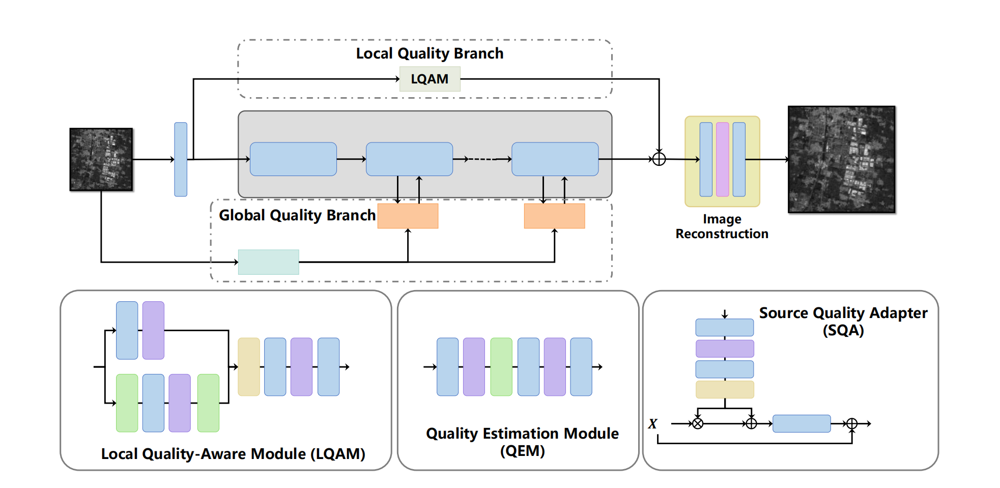

# 🛰️ QAHAT: Quality-Aware Hybrid Attention Transformer

### [NTIRE 2026 Challenge on Remote Sensing Infrared Image Super-Resolution (x4)](https://cvlai.net/ntire/2026/) @ [CVPR 2026](https://cvpr.thecvf.com/)

**Team Name:** WHU-VIP (Team ID: 11)  
**Authors:** Ce Wang, Xingwei Zhong, Wanjie Sun

[](https://pytorch.org/)
[](LICENSE)
[](https://cvlai.net/ntire/2026/)

---

## 🌟 Overview

This repository contains the official implementation of **QAHAT**, the solution developed by team **WHU-VIP** for the NTIRE 2026 Infrared Image Super-Resolution challenge.

### Key Features

- **QEM (Quality Estimation Module):** A lightweight network that predicts a global quality descriptor of the input image.
- **LQAM (Local Quality-Aware Module):** A local quality branch that captures spatially varying artifacts using a downsampling–upsampling structure with a large receptive field.
- **SQA (Source Quality Adapter):** Injects the predicted quality representation into multiple stages of the HAT backbone.
- **Optimized Loss:** Trained with a custom weighted loss: $\mathcal{L} = -PSNR - 20 \cdot SSIM$.

---

## 🏆 Challenge Results

Our method achieved **1st place** on the NTIRE 2026 Remote Sensing Infrared Image Super-Resolution Challenge leaderboard (Testing Phase):

| # | Team | Score | PSNR | SSIM |
|---|------|-------|------|------|
| 🥇 | **diffusion (Ours)** | **54.436** | **35.9643** | **0.92359** |

---

## 🛠️ Proposed Method

  
*Figure 1: The overall architecture of our proposed Quality-Aware Hybrid Attention Transformer (QAHAT).*

---

## 📦 Installation

```bash
# Clone the repository
git clone https://github.com/ZaxWave/NTIRE2026_infraredSR_WHUVIP.git
cd NTIRE2026_infraredSR_WHUVIP

# Create environment
conda create -n qahat python=3.8 -y
conda activate qahat

# Install dependencies
pip install -r requirements.txt
```

---

## 📥 Pretrained Models

The pretrained model weights (`QAHAT_best.pth`) can be downloaded from the following sources:

| Source | Link |
|--------|------|
| GitHub Release | [Download](https://github.com/ZaxWave/NTIRE2026_infraredSR_WHUVIP/releases/download/v1.0/QAHAT_best.pth) |
| Tmp.link | [Download](https://tmp-hd100.vx-cdn.com/file-69b94fe3993ec-69b95494f1fa3/QAHAT_best.pth) |
| Cloud Server | [Download](http://47.121.183.42:8080/QAHAT_best.pth) |
| Baidu Netdisk | [Download](https://pan.baidu.com/s/1xP6TzI3DceewjyTjt6GFFA?pwd=nffc) (Password: `nffc`) |

> **MD5:** `a4a9c737a89fb8e1e8b57908c79d1233`

```bash
# Download via wget
wget https://github.com/ZaxWave/NTIRE2026_infraredSR_WHUVIP/releases/download/v1.0/QAHAT_best.pth
# or
wget https://tmp-hd100.vx-cdn.com/file-69b94fe3993ec-69b95494f1fa3/QAHAT_best.pth
# or
wget http://47.121.183.42:8080/QAHAT_best.pth
```

---

## 📊 Results

The super-resolution results (`QAHAT_result_best.zip`) can be downloaded from:

| Source | Link |
|--------|------|
| GitHub Release | [Download](https://github.com/ZaxWave/NTIRE2026_infraredSR_WHUVIP/releases/download/v1.0/QAHAT_result_best.zip) |
| Tmp.link | [Download](https://tmp-hd106.vx-cdn.com/file-69b95051f101c-69b955ab45469/QAHAT_result_best.zip) |
| Cloud Server | [Download](http://47.121.183.42:8080/QAHAT_best.zip) |
| Baidu Netdisk | [Download](https://pan.baidu.com/s/1p-b_Zz6NQhpeFb-QPpk6KA?pwd=p8n3) (Password: `p8n3`) |

```bash
# Download via wget
wget https://github.com/ZaxWave/NTIRE2026_infraredSR_WHUVIP/releases/download/v1.0/QAHAT_result_best.zip
# or
wget https://tmp-hd106.vx-cdn.com/file-69b95051f101c-69b955ab45469/QAHAT_result_best.zip
# or
wget http://47.121.183.42:8080/QAHAT_best.zip
```
